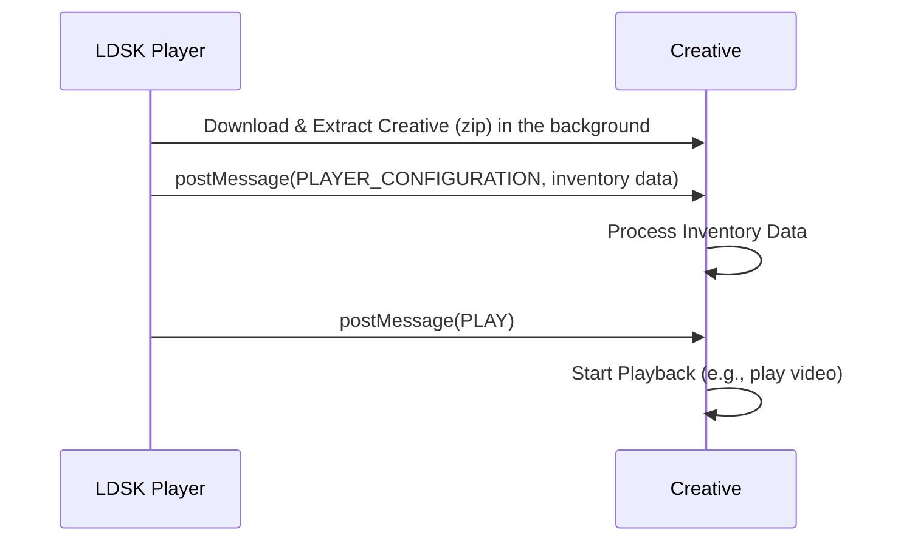

# LDSK HTML5 Creative Development Kit

This repository provides tools and examples to help you create and optimize dynamic HTML5 creatives for the LiveDOOH Signkick (LDSK) platform. The repository is hosted on GitHub at: [https://github.com/livedooh-Git/ldsk-dynamic-samples](https://github.com/livedooh-Git/ldsk-dynamic-samples)

## Overview

LDSK is a powerful digital signage platform that enables you to deliver engaging, dynamic content to your audience. This kit provides three worked examples — from a basic creative, to player-side media caching, to fully delegated native playback (recommended for Samsung Tizen).

In a high level view this is the sequence of events that happen when a creative is loaded in the LDSK player:


```mermaid
sequenceDiagram
   LDSK Player->>Creative: Download & Extract Creative (zip) in the background
   LDSK Player->>Creative: postMessage(PLAYER_CONFIGURATION, inventory data)
   Creative->>Creative: Process Inventory Data
   LDSK Player->>Creative: postMessage(PLAY)
   Creative->>Creative: Start Playback (e.g., play video)
```

## Repository Structure

* **basic-workflow:** A simple HTML5 creative that demonstrates the core structure and postMessage communication with the LDSK player (`PLAYER_CONFIGURATION`, `PLAY`).
* **optimized-with-caching:** An enhanced creative showcasing how to request and use cached media assets (images, videos) via `MEDIA_REQUEST` / `MEDIA_RESPONSE` for faster loading and reduced bandwidth usage.
* **delegated-playback:** A creative that delegates media playback to the native LDSK player using `DELEGATE_PLAY`. **Recommended for Samsung Tizen screens**, as it avoids multiple `<video>` element conflicts and lets the player manage caching and playback natively.

## Getting Started

1. **Clone the Repository:**

   ```bash
   git clone https://github.com/livedooh-Git/ldsk-dynamic-samples.git
   ```

2. **Explore the Examples:**
    * **basic-workflow:** Understand the basic structure of an HTML5 creative and how to interact with LDSK events (`PLAYER_CONFIGURATION`, `PLAY`).
    * **optimized-with-caching:** Learn how to send `MEDIA_REQUEST` messages and handle `MEDIA_RESPONSE` events to utilize cached media.
    * **delegated-playback:** Learn how to hand media playback to the native player with `DELEGATE_PLAY` — the recommended approach for Tizen.
3. **Adapt and Create:**
    * Use the examples as templates to build your own creatives.
    * Customize the content, styling, and interactivity to suit your campaign goals.


## Key Concepts


* **postMessage API:** The primary way your creative communicates with the LDSK player.
* **PLAYER_CONFIGURATION Event:** Provides inventory data about the screen (e.g., location, attributes) for dynamic content personalization.
* **PLAY Event:** Signals the exact moment to start your creative's playback.
* **MEDIA_REQUEST, MEDIA_RESPONSE, and MEDIA_REQUEST_EXCEPTION Events:** Enable media caching and efficient loading. See [optimized-with-caching](./optimized-with-caching/readme.md).
* **DELEGATE_PLAY and DELEGATE_PLAY_RESPONSE Events:** Delegate media playback to the native player instead of rendering it in the creative. Recommended for Samsung Tizen. See [delegated-playback](./delegated-playback/README.md).

## **Packaging Your Creative**

Before deploying your HTML5 creative to LDSK, you need to package it into a ZIP archive:

1. **Gather Your Assets:**
   * **`index.html`:** Your main HTML file.
   * **Other HTML files (if any):** Any additional HTML files used by your creative.
   * **JavaScript files (`.js`):** Your creative's logic and interactivity.
   * **CSS files (`.css`):** Styles for your creative.
   * **Images (`.jpg`, `.png`, etc.):** Visual assets.
   * **Videos (`.mp4`):** Video content.
   * **Other assets (fonts, etc.):** Any other files required by your creative.
2. **Create the ZIP Archive:**
   * Create a new folder to hold your creative.
   * Place all of your creative's assets inside this folder.
   * Select all the files and folders within the creative folder.
   * Right-click and choose "Compress" (or similar option) to create a ZIP archive.
3. **Important Considerations:**
   * **Root Level `index.html`:** Make sure your `index.html` file is at the root level of the ZIP archive (not inside a subfolder).
   * **No Nested ZIPs:** Do not include other ZIP archives within your creative's ZIP file.
   * **Relative Paths:** Ensure that all file paths within your creative (e.g., references to images or videos) are relative to the `index.html` file.


## Tips and Best Practices

* **Thorough Testing:** Test your creatives on a variety of devices and browsers to ensure compatibility.
* **Performance Optimization:** Optimize image and video file sizes to minimize loading times.
* **Error Handling:** Always include fallback mechanisms (e.g., default images) to handle situations where media caching fails.
* **Keep Up-to-Date:** Stay informed about the latest LDSK updates and guidelines to ensure optimal performance and compatibility.

## Important Considerations
* **Video element tags**: If targeting your creative to a network with LDSK player that is using Samsung Tizen screens, 
do not to add a `<video>` element tag in your creative's HTML markup, instead add it programmatically with Javascript. This is because
the Samsung Tizen screens struggle when more than one `<video>` element tag present, given that the creative is preloading 
behind the scenes, it is very possible that another `<video>` element tag is presently playing. This will cause the screen
 to blank into a black frame and the creative will not play.

## How to Run the Examples

1. change to corresponding directory.
2. run `npm install` to install the dependencies.
2. run `npm start` to start the server.  This will load player-simulator.html in your browser which loads index.html in an iframe.
3. Open the browser console to see the events being sent to the creative.
4. The creative will choose a video after evaluating the inventory context.
5. The creative will start playing the video after 5 seconds.


## Contributing

We welcome contributions to this repository! If you have improvements, bug fixes, or new examples, please submit a pull request.


