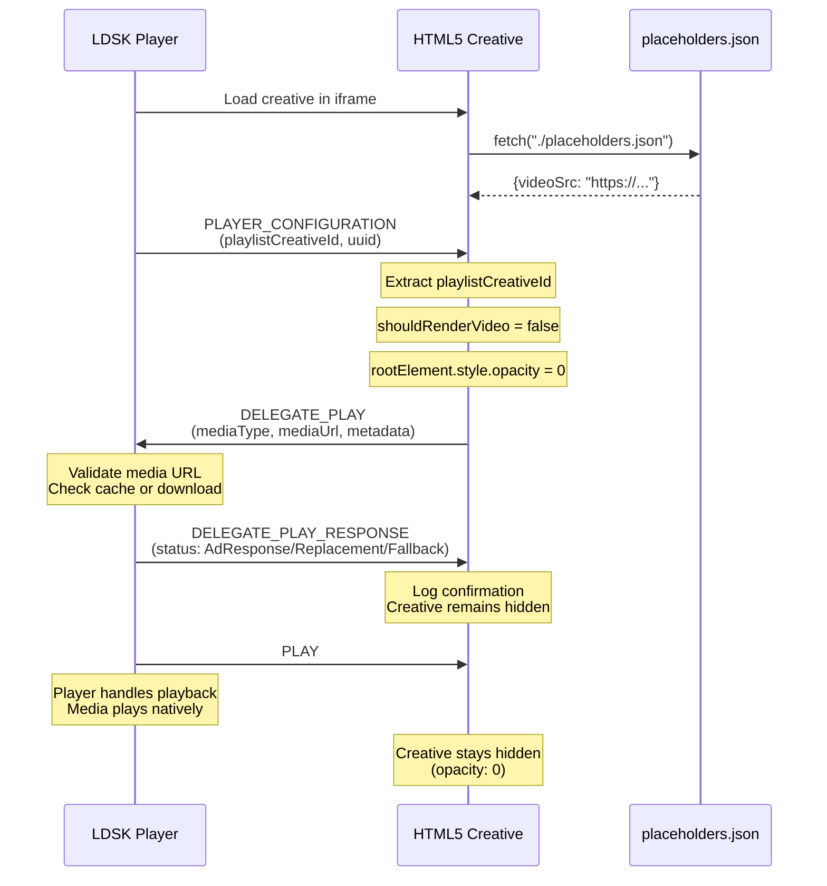

# LDSK Delegated Playback Template

## Developer Guide: The Delegate Play Protocol

> **Purpose:** This template demonstrates how to implement the DELEGATE_PLAY pattern, where your HTML5 creative delegates media playback to the native LDSK Player component instead of rendering it within the creative itself.

## Table of Contents

1. [The Concept](#1-the-concept)
2. [Step-by-Step Flow](#2-step-by-step-flow)
3. [Implementation Example](#3-implementation-example)
4. [Template-Specific Implementation](#4-template-specific-implementation)
5. [Testing with the Player Simulator](#5-testing-with-the-player-simulator)
6. [Complete Event Flow](#6-complete-event-flow)
7. [Quick Reference](#7-quick-reference)

---

## 1. The Concept

The "Delegate Play" pattern is a two-step handshake. Your template identifies the media it wants to show, but instead of rendering it, it asks the native Player to handle the playback.

- **Request:** The Template sends `DELEGATE_PLAY` with the media details.
- **Response:** The Player sends back `DELEGATE_PLAY_RESPONSE` to confirm it has received the command and is taking over.

### Player Support

DELEGATE_PLAY is supported on the following LDSK player versions:

| Platform | Minimum Version | Latest Version | Status |
|----------|----------------|----------------|--------|
| **Tizen / Windows / Linux** | v19.6.2+ | v19.7.2 | ✅ Supported |
| **BrightSign** | v2025.1.0+ | v2025.3.0 | ✅ Supported |
| **VXT** | All versions | - | ✅ Supported |
| **Android** | - | - | ❌ Not Supported |

> **Important:** Ensure your target screens are running compatible player versions. For Android players, you must implement direct video playback instead of using DELEGATE_PLAY.

### Why Use This Pattern?

**Benefits:**
- **Player-managed media caching and optimization** - The player handles downloading and caching, reducing redundant network requests
- **Reduced memory footprint** - Your creative doesn't need to load and manage large media files
- **Better performance on resource-constrained devices** - Especially critical for Samsung Tizen screens
- **Centralized media handling** - The player manages playback lifecycle, timing, and transitions
- **Avoids multiple video element conflicts** - Prevents issues when multiple `<video>` elements exist on Tizen devices

> **Note:** This pattern is particularly important for Samsung Tizen screens, which struggle when more than one `<video>` element is present. Since creatives preload in the background, delegating playback to the player avoids conflicts.

---

## 2. Step-by-Step Flow

### Step A: Sending the Request (DELEGATE_PLAY)

**Trigger:** This usually happens immediately after your template receives its configuration (e.g., inside the `PLAYER_CONFIGURATION` event).

**Action:**
1. Construct the payload containing the media URL and metadata.
2. Hide your template's visual elements (e.g., `opacity: 0`).
3. Dispatch the message to the parent window.

**Code Payload:**

```javascript
var payload = {
    mediaType: "VIDEO",          // or "IMAGE"
    mediaUrl: "https://...",     // The direct link to the file
    playlistCreativeId: "...",   // Passed from player config
    replacementMediaType: "...", // Optional fallback
    replacementMediaUrl: "...",  // Optional fallback
    uuid: "..."                  // Unique ID from player config
};

window.top.postMessage({
    type: "DELEGATE_PLAY",
    eventType: "DELEGATE_PLAY",
    payload: payload
}, "*");
```

### Step B: Handling the Response (DELEGATE_PLAY_RESPONSE)

**Trigger:** The Player component receives your request, validates the media, and sends a confirmation back to your template.

**Action:** Your template should listen for this event to confirm the hand-off was successful. This is useful for debugging or analytics.

**Response Payload Structure:**

The player will send an object containing a status string:
- `AdResponse`: The Player successfully took over playback.
- `Replacement`: The Player took over but is playing a replacement/fallback media.
- `Fallback`: The Player is using a fallback mechanism.

---

## 3. Implementation Example

This snippet focuses purely on the delegation logic. It ignores editor/preview modes.

```html
<script>
    // 1. Setup Listeners
    window.addEventListener("load", function() {
        window.addEventListener("message", handleMessages);
    });

    function handleMessages(event) {
        const data = event.data;

        // --- OUTGOING: SEND REQUEST ---
        // Triggered when the player sends us the initial config
        if (data.type === "PLAYER_CONFIGURATION") {
            
            // 1. Prepare the Media Data
            // (Assumes you have fetched or calculated the correct URL already)
            const mediaUrl = "https://example.com/video.mp4"; 

            const delegatePayload = {
                mediaType: "VIDEO",
                mediaUrl: mediaUrl,
                playlistCreativeId: data.playlistCreativeId || "", 
                uuid: data.uuid,
                // Pass through any fallbacks if provided in config
                replacementMediaType: data.replacementMediaType,
                replacementMediaUrl: data.replacementMediaUrl
            };

            // 2. Hide Self
            // We hide immediately to prevent double-rendering (browser + native)
            document.body.style.opacity = "0";

            // 3. Send the Command
            postMessageToParent("DELEGATE_PLAY", delegatePayload);
        }

        // --- INCOMING: RECEIVE CONFIRMATION ---
        // Triggered when the player confirms it received the command
        if (data.eventType === "DELEGATE_PLAY_RESPONSE") {
            console.log("Player Response Received:", data);

            switch (data.status) {
                case 'AdResponse':
                    console.log("Success: Player is handling native playback.");
                    break;
                case 'Replacement':
                case 'Fallback':
                    console.warn("Notice: Player is using fallback media.");
                    break;
                default:
                    console.error("Error: Unknown response status.", data.status);
            }
        }
    }

    // Helper to safely post messages to the top window
    function postMessageToParent(type, payload) {
        window.top.postMessage({
            type: type,
            eventType: type,
            payload: payload
        }, "*");
    }
</script>
```

---

## 4. Template-Specific Implementation

### Loading Media URLs from Placeholders

The template uses a dual-loading strategy for media URLs:

```javascript
// Primary: Load from JSON file
fetch("./placeholders.json")
  .then((response) => response.json())
  .then((data) => {
    // data.videoSrc contains the media URL
    setLiveData(data);
  })
  .catch((err) => {
    // Fallback: Use inline JavaScript variable
    let data = placeholders;
    setLiveData(data);
  });
```

**Example `placeholders.json`:**
```json
{
  "videoSrc": "https://remote.com/video.mp4",
  "videoLocalSrc": "video.mp4"
}
```

**Example `placeholders.js`:**
```javascript
var placeholders = {
  "videoSrc": "https://remote.com/video.mp4",
  "videoLocalSrc": "video.mp4"
};
```

> **Why two files?** The JSON file is used in production, while the JS file serves as a fallback if the fetch fails. This ensures robustness across different deployment scenarios.

### Fallback: Using Video Element

If the DELEGATE_PLAY handshake fails or encounters errors, you can implement a fallback to render the video directly in your creative using a `<video>` element.

**Fallback Implementation:**

```javascript
// Listen for DELEGATE_PLAY_RESPONSE errors
if (data.eventType === "DELEGATE_PLAY_RESPONSE") {
  if (data.status === 'Error' || !data.status) {
    // Delegation failed - fallback to local playback
    shouldRenderVideo = true;
    createVideoElement();
    videoElement.src = mediaUrl;
    rootElement.style.opacity = 1;  // Show creative
    videoElement.play();
  }
}
```

This ensures your creative can still play media even if the player cannot handle the delegation request.

> **Note:** When creating video elements programmatically as a fallback, be mindful of Samsung Tizen devices which may have issues with multiple video elements.

---

## 5. Testing with the Player Simulator

The template includes `player.html`, which simulates the LDSK player for local testing.

**Key Functions:**
- `sendPostMessage(message, iFrameId)`: Sends messages to the creative iframe
- `receiveMessage(event)`: Receives messages from the creative
- `initFunc()`: Sends `PLAYER_CONFIGURATION` with inventory data

**Testing Steps:**
1. **Open `player.html`** in your browser
2. The creative loads automatically in an iframe
3. **Open browser console** to see the message flow
4. **Click "Init" button** to send `PLAYER_CONFIGURATION`
5. **Observe in console:**
   - Creative receives `PLAYER_CONFIGURATION`
   - Creative sends `DELEGATE_PLAY`
   - Player sends `DELEGATE_PLAY_RESPONSE`
   - Creative logs the response

---

## 6. Complete Event Flow



---

## 7. Quick Reference

### Event Types

| Event Type | Direction | Purpose | Required Fields |
|------------|-----------|---------|----------------|
| `PLAYER_CONFIGURATION` | Player → Creative | Initialize creative with config and inventory data | `playlistCreativeId`, `uuid`, `inventory` |
| `DELEGATE_PLAY` | Creative → Player | Request player to handle media playback | `mediaType`, `mediaUrl`, `playlistCreativeId`, `uuid` |
| `DELEGATE_PLAY_RESPONSE` | Player → Creative | Confirm delegation status | `eventType`, `status`, `mediaUrl` |
| `PLAY` | Player → Creative | Signal playback start time | (none - just trigger) |

### Response Status Values

| Status | Meaning |
|--------|---------|
| `AdResponse` | Player successfully took over and is playing the requested media |
| `Replacement` | Player is playing replacement/fallback media instead |
| `Fallback` | Player is using a fallback mechanism |

---

## Summary

The DELEGATE_PLAY pattern is a powerful way to optimize media playback in LDSK creatives, especially for Samsung Tizen devices. By delegating playback to the player component, you reduce memory usage, avoid technical conflicts, and benefit from the player's caching mechanisms.

**Key Takeaways:**
1. Send `DELEGATE_PLAY` after receiving `PLAYER_CONFIGURATION`
2. Always handle the `DELEGATE_PLAY_RESPONSE` for confirmation
3. Hide your creative (opacity: 0) when delegating playback
4. Use `placeholders.json` and `placeholders.js` for media URLs
5. Implement video element fallback for error scenarios
6. Test thoroughly with the included `player.html` simulator

For more examples and documentation, refer to the [main repository README](../README.md).
