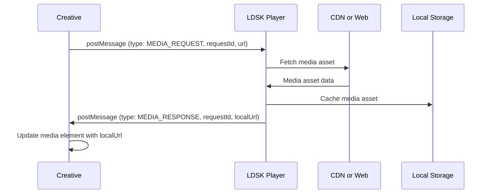

## Description
This example demonstrates how to optimize media loading and reduce bandwidth usage within your HTML5 creatives using the LDSK player.

## Pre-requisites
Please ensure that you have a good grasp on the basic workflow of the LDSK player already covered in
the [basic workflow example](../basic-workflow/readme.md).

### How to Run the Example

1. run `npm install` to install the dependencies.
2. run `npm start` to start the server.  This will load player-simulator.html in your browser which loads index.html in an iframe.
3. Open the browser console to see the events being sent to the creative.
4. The creative will choose a video after evaluating the inventory context.
5. The creative will start playing the video after 5 seconds.

## Media Caching Sequence
To optimize media loading and reduce bandwidth usage within your HTML5 dynamic creatives, LDSK provides a mechanism for centralized caching.

In this example we cover the following events:
1. MEDIA_REQUEST
2. MEDIA_RESPONSE
3. MEDIA_REQUEST_EXCEPTION
## Sequence Diagram: Media Optimization Workflow




## MEDIA_REQUEST Event

* **Triggered by:** Your creative, when it needs to load an external media asset (image, video).
* **Sent to:** The parent window (LDSK player).
* **Purpose:** Asks LDSK to fetch the media and cache it locally.
* **Payload:**

```json
{
  "eventType": "MEDIA_REQUEST",
  "type": "MEDIA_REQUEST",
  "payload": {
    "mediaType": "image",
    "mediaUrl": "https://example.com/images/my-image.jpg",
    "requestId": "unique-id",
    "uuid": "UUID_FROM_PLAYER_CONFIGURATION"  
  }
}
```


**Example (Triggering a Media Request):**

JavaScript

```javascript
var img = new Image();
img.onload = function() { /* handle successful load */ };
img.onerror = function() {
    parent.postMessage({
        type: 'MEDIA_REQUEST',
        requestId: 'image123', 
        url: this.src
    }, '*');
};
img.src = 'https://example.com/images/my-image.jpg';
```


## MEDIA_RESPONSE Event


* **Triggered by:** LDSK player, after successfully caching the media asset.
* **Sent to:** Your creative (the iframe).
* **Purpose:** Provides the local file path of the cached asset.
* **Payload:**

JavaScript

```json
{
  "type": "MEDIA_RESPONSE",
  "eventType": "MEDIA_RESPONSE",
  "requestId": "unique-id",  
  "localUrl": "/path/to/cached/image.jpg",
  "mediaType": "image"
}
```

**Example (Handling a Media Response):**

JavaScript

```javascript
window.addEventListener('message', (event) => {
  if (event.data.type === 'MEDIA_RESPONSE' && event.data.requestId === 'image123') {
    var img = document.getElementById('myImage');
    img.src = event.data.localUrl;
  } 
});
```

## MEDIA_REQUEST_EXCEPTION Event

* **Triggered by:** LDSK player, if there's an error caching the media.
* **Sent to:** Your creative (the iframe).
* **Purpose:** Notifies you of the failure so you can take alternative action.
* **Payload:** May include error details, but this is not guaranteed.

**Example (Handling a Media Exception):**

JavaScript

```javascript
window.addEventListener('message', (event) => {
  if (event.data.type === 'MEDIA_REQUEST_EXCEPTION' && event.data.requestId === 'image123') {
    var img = document.getElementById('myImage');
    img.src = 'fallback.jpg'; // Load a fallback image
  } 
});
```
**Key Points:**

* **Reduced Bandwidth:** This mechanism prevents multiple downloads of the same asset across different creatives.
* **Improved Performance:** Local assets load faster than fetching them over the network.  Providing a seamless playback experience.
* **Error Handling:** Always include a fallback plan (e.g., default image) in case a media request fails.

## Important Considerations
* **Video element tags**: If targeting your creative to a network with LDSK player that is using Samsung Tizen screens,
  do not to add a `<video>` element tag in your creative's HTML markup, instead add it programmatically with Javascript. This is because
  the Samsung Tizen screens struggle when more than one `<video>` element tag present, given that the creative is preloading
  behind the scenes, it is very possible that another `<video>` element tag is presently playing. This will cause the screen
  to blank into a black frame and the creative will not play.
